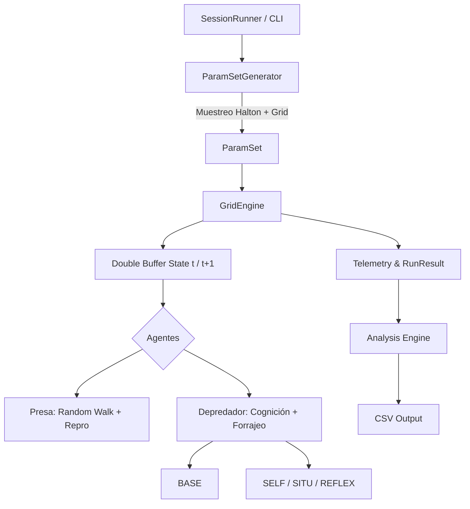

# Especificación Arquitectónica: Motor SIM_RAM_CONTEX

## 1. Propósito del Documento
Este directorio contiene la especificación de ingeniería de software y el diseño algorítmico del motor de simulación de ecosistemas presa-depredador cognitivo (`SIM_RAM_CONTEX`).
El objetivo es proporcionar un manual agnóstico del lenguaje (actualmente en Java) para que otro Agente de Inteligencia Artificial o equipo de desarrollo pueda comprender, reimplementar o migrar el motor a plataformas como Python (Mesa), C++ (Repast) o NetLogo, garantizando la equivalencia matemática y científica de los resultados.

## 2. Índice de Especificación
La documentación se divide en los siguientes módulos para facilitar la ingesta semántica de agentes LLM:
*   **01_DINAMICA_ESPACIAL_Y_TIEMPO:** Motor de física, topología, autómata celular y sincronización.
*   **02_AGENTES_Y_METABOLISMO:** Reglas duras de fisiología, termodinámica y ciclo vital.
*   **03_ARQUITECTURA_COGNITIVA:** Implementación algorítmica de los perfiles de Markov, SELF, SITU y REFLEX.
*   **04_MUESTREO_Y_PARAMETROS:** Espacio de búsqueda, secuencia de Halton y variables ambientales.
*   **05_TELEMETRIA_Y_METRICAS:** Fórmulas matemáticas de Viabilidad Robusta, Entropía y matrices de transición.
*   **07_ARQUITECTURA_CONCURRENCIA:** Patrón de ejecución, Thread Pools y Double Buffering.
*   **08_ESQUEMAS_DE_DATOS_Y_TELEMETRIA:** Contratos CSV, formato MTEL binario y codificación Bitwise para Cadenas de Markov.
*   **09_CONFIGURACION_INPUTS:** Esquema JSON para reproducibilidad y carga de simulaciones automatizadas.
*   **10_AGENTE_DOCUMENTADOR_PROMPT:** Metaprompt utilizado para la auto-generación de esta especificación.

## 3. Arquitectura General del Sistema
El motor opera bajo el paradigma de **Modelado Basado en Agentes (ABM)** integrado con un **Autómata Celular (CA)** estocástico.

## 4. Estándares Científicos de la Reimplementación
Toda reimplementación debe cumplir con tres principios:
1.  **Determinismo Estocástico:** Dada la misma semilla (Seed), el sistema debe replicar bit a bit las 500 iteraciones del ecosistema.
2.  **Exclusión Competitiva Estricta:** La grilla nunca debe tener más de 1 agente por coordenada.
3.  **Simetría de Actualización:** El orden de los agentes debe ser aleatorizado por cada tick (Shuffle) para evitar sesgos direccionales.