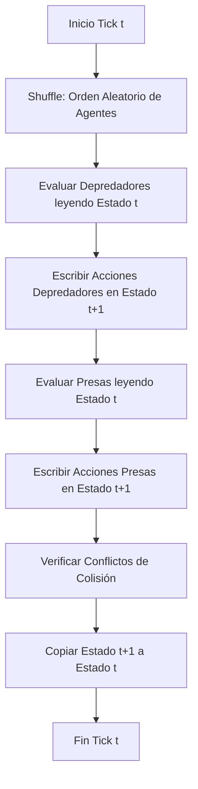

# Módulo 01: Dinámica Espacial y Manejo del Tiempo

## 1. Topología Espacial (Física del Mundo)
El mundo se representa como un Autómata Celular bidimensional.
*   **Estructura de Datos:** Arreglo unidimensional (1D array) optimizado para caché, mapeado a coordenadas 2D: `index = y * width + x`.
*   **Estados de Celda:** Cada celda puede contener estrictamente un valor: `0` (EMPTY), `1` (PREY), o `2` (PRED).
*   **Topología:** Toroidal (Mundo continuo).
    *   *Fórmula matemática (wrapping):* 
        $$x_{new} = (x + \Delta x + N) \pmod N$$
        $$y_{new} = (y + \Delta y + N) \pmod N$$
    *   *Referencia Científica:* Grimm et al. (2005) - Evita efectos de borde y hacinamiento artificial en ecología espacial.
*   **Vecindad:** Vecindad de Moore (8 direcciones). Parametrizada por el radio de percepción $R$. Rango de celdas escaneadas = $(2R+1)^2 - 1$.

## 2. Motor de Tiempo (Sincronización Discreta)
El tiempo es discreto ($t$). Para prevenir sesgos de asimetría direccional o ventaja del primer actor, se implementa una técnica de **Double Buffering** (Buffer de Lectura vs Buffer de Escritura).

### 2.1. Arquitectura del Tick (Flujo de Sincronización)


### 2.2. Implementación en Código (El Ciclo de Vida)
El siguiente fragmento demuestra cómo el motor separa los buffers y aleatoriza el orden en `GridEngine.java`:

```java
// Limpiar buffers para t+1
for (int i=0; i<n; i++) { 
    nextCells[i] = 0; 
    nextEnergy[i] = 0; 
}

// Orden aleatorio para evitar sesgos
shuffle(coords, rng);

// Procesar Depredadores
for (int k=0; k<n; k++) {
    int idx = coords[k];
    if (grid.cells[idx] != Grid.PRED) continue;
    // Lógica del depredador... escribe en nextCells y nextEnergy
}

// Procesar Presas
for (int k=0; k<n; k++) {
    int idx = coords[k];
    if (grid.cells[idx] != Grid.PREY) continue;
    // Lógica de la presa... escribe en nextCells
}

// Commit de t+1 al Tablero Real
for (int q=0; q<n; q++) {
    grid.cells[q] = nextCells[q]; 
    grid.energy[q] = nextEnergy[q];
}
```

Esta separación garantiza que si un depredador caza a una presa en $t$, la presa es removida del `nextCells`, pero cuando le toca su turno de evaluación, la rutina verifica este cambio para abortar su movimiento.