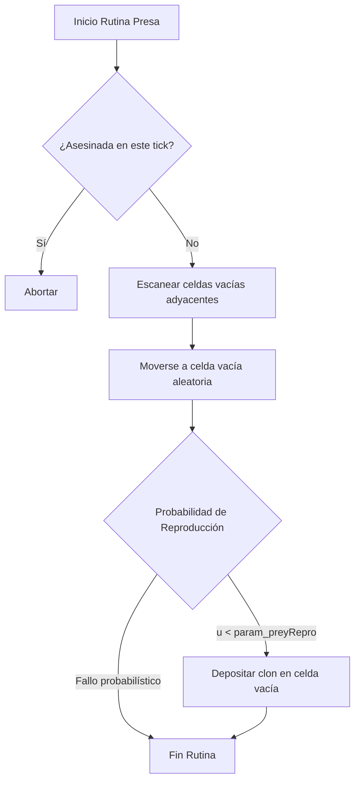
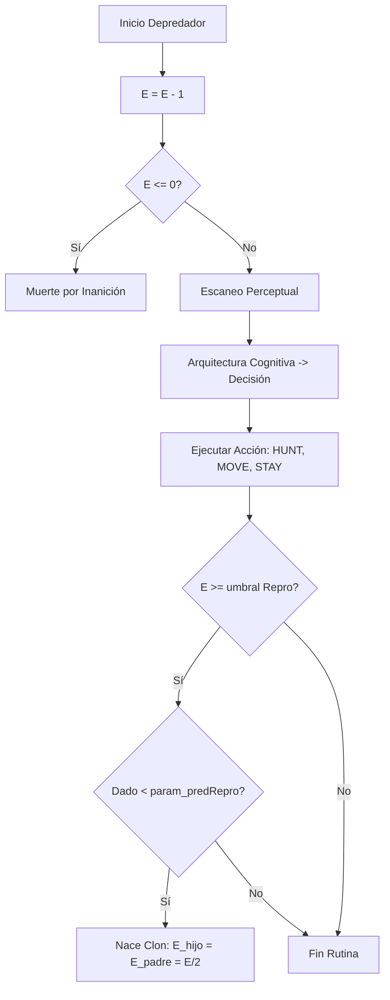

# Módulo 02: Biología, Agentes y Metabolismo

## 1. Reglas Generales de Energía y Termodinámica
A diferencia de los modelos Lotka-Volterra abstractos, este ABM simula el balance metabólico (Dynamic Energy Budget).
*   Las **Presas** no poseen límite energético. Tienen vida infinita a menos que sean cazadas.
*   Los **Depredadores** almacenan energía ($E$).
*   *Referencia:* Kooijman (2010). Dynamic Energy Budget Theory.

Ecuación de balance energético por tick para un depredador:
$$E_{t+1} = E_t - C_{basal} - C_{cognitivo} + \Delta E_{caza}$$
Donde $C_{basal} = 1$, $\Delta E_{caza} = param\_predEnergyEat$ (si la acción es HUNT), y $C_{cognitivo}$ aplica si se usa el mecanismo REFLEX.

## 2. Ciclo Vital de la Presa (Prey Routine)


Una presa procesada en el tick $t$:
1.  **Supervivencia:** Verifica si en este mismo tick un depredador ya se movió a su celda en el `writeBuffer`. Si es así, se aborta su rutina.
2.  **Movimiento:** Escanea su vecindad de Moore de Radio $R=1$. Identifica celdas `EMPTY`. Selecciona una al azar uniforme. Se mueve. Si no hay celdas vacías, se queda en el sitio (`STAY`).
3.  **Reproducción:**
    *   Tira un dado uniforme $u \in [0, 1)$.
    *   Si $u < param\_preyRepro$, intenta reproducirse buscando celdas `EMPTY` adyacentes a su nueva posición.

## 3. Ciclo Vital del Depredador (Predator Routine)


### 3.1. Metabolismo e Inanición en Código
El depredador procesa su costo de existencia inmediatamente. Si la energía cae a cero o menos, el agente muere y la rutina se interrumpe (`continue`).

```java
int e0 = grid.energy[idx];
int e = e0 - 1; 
if (e <= 0) { 
    death_starve++; 
    stepDeathStarve++; 
    continue; // Agente eliminado
}
```

### 3.2. Percepción y Acción
El depredador escanea el entorno basado en $param\_perceptionRadius$.
Invoca a la Arquitectura Cognitiva (Módulo 03) para decidir una `Action`.
*   `HUNT`: Elige aleatoriamente una presa avistada.
*   `MOVE`: Elige aleatoriamente una celda vacía.
*   `STAY`: No se mueve.

```java
if (action == Action.HUNT && selPreyIdx >= 0) {
    dest = selPreyIdx; 
    e += p.predEnergyEat; // Ganancia calórica
    stepDeathEaten++;
    // ...
}
```

### 3.3. Reproducción (Mitosis Energética)
Si el depredador sobrevive a su acción, evalúa reproducirse cediendo la mitad de su energía:

```java
// Mitosis si la energía alcanza el umbral reproductivo
if (nextCells[dest] == Grid.PRED && 
    nextEnergy[dest] >= p.predEnergyRepro && 
    rng.nextDouble() < p.predRepro) {
    
    int babyIdx = randomEmptyAdj(size, dest, nextCells, rng);
    if (babyIdx >= 0) {
        nextCells[babyIdx] = Grid.PRED;
        int babyE = nextEnergy[dest] / 2;
        nextEnergy[dest] -= babyE;
        nextEnergy[babyIdx] = babyE;
        stepBirthPred++;
    }
}
```