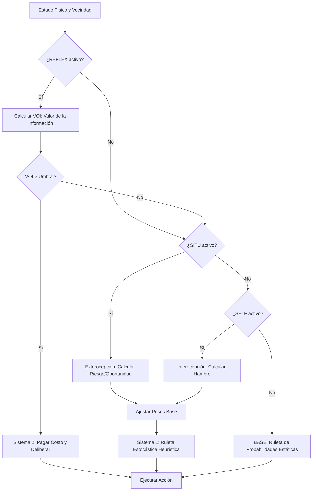

# Módulo 03: Arquitectura Cognitiva (Niveles SELF, SITU, REFLEX)

La toma de decisión del depredador está mediada por una tubería (pipeline) de componentes modulares que escalan la cognición del agente desde un Modelo Nulo estocástico hasta un proceso de Racionalidad Acotada con Metacognición. 

El objetivo de esta especificación es permitir la reimplementación exacta de la lógica cognitiva en otros lenguajes de simulación.

## 0. Pipeline Cognitivo


## 1. Variables Fisiológicas y Ambientales de Percepción

Antes de activar las heurísticas, el agente mide matemáticamente su entorno de Moore ($R$):

1.  **Hambre ($H$):** Medida en un rango $[0, 1]$. Se calcula en base a la energía máxima empírica $E_{max} = \max(8, E_{init} + E_{eat}, E_{repro})$.
    $$H_{lineal} = 1.0 - \min\left(1.0, \frac{E}{E_{max}}\right)$$
    Si la configuración `param_self_hunger_mode` es `sigmoide`, se aplica una transformación logística que retrasa la sensación de hambre hasta que la energía baja críticamente.
2.  **Oportunidad ($Opp$):** Proporción de presas en el rango de visión sobre el total de celdas escaneadas ($N_{nb}$).
    $$Opp = \min\left(1.0, \frac{preyCount}{N_{nb}}\right)$$
3.  **Riesgo de Competencia ($Risk$):** Proporción de depredadores rivales en el rango de visión.
    $$Risk = \min\left(1.0, \frac{predCount}{N_{nb}}\right)$$
4.  **Distancia Normalizada ($d_{norm}$):** Distancia de Chebyshev hasta la presa más cercana en la vecindad, normalizada por el radio de percepción $R$.
    $$d_{norm} = \frac{\min(d(x,y, presa))}{R}$$

## 2. BASE: El Modelo Nulo (Políticas Estacionarias)
*   **Descripción:** Representa un organismo sin memoria ni conciencia de estado (Amnesia de Estado y Ceguera de Contexto).
*   **Restricción Física:** Si no ve presas, $W_{hunt} = 0$. Si está atrapado, $W_{move} = 0$. 

Ecuación de selección por ruleta (Probabilidad Normalizada):
$$P(a_i) = \frac{W_i}{\sum_{j \in \{H,M,S\}} W_j}$$

Implementación en código (`GridEngine.java`):
```java
private static Action sampleAction(
        SplittableRandom rng,
        double huntWeight,
        double moveWeight,
        double stayWeight,
        boolean canHunt,
        boolean canMove
) {
    double sh = canHunt ? Math.max(0.0, huntWeight) : 0.0;
    double sm = canMove ? Math.max(0.0, moveWeight) : 0.0;
    double ss = Math.max(0.0, stayWeight);
    double sum = sh + sm + ss;
    
    if (sum <= 0.0) return Action.STAY;
    
    double u = rng.nextDouble() * sum;
    if (u < sh) return Action.HUNT;
    if (u < sh + sm) return Action.MOVE;
    return Action.STAY;
}
```

## 3. SELF: Modulación Homeostática (Interocepción)
*   **Propósito:** Permite al agente abandonar la política estacionaria modificando sus pesos base de acción en función de su hambre.
*   **Mecánica Base (`h_move` o `h_all`):** 
    - El peso base de la acción `MOVE` (exploración) decrece logísticamente para favorecer conservación si hay poca comida: $W_{move} = W_{move} \times (0.5 + 0.5 \times H)$.
    - El peso base de la acción `HUNT` incrementa agresivamente si hay hambre y presas presentes: $W_{hunt} = W_{hunt} + 0.5 \times H$.

## 4. SITU: Sensibilidad Situacional (Exterocepción)
*   **Propósito:** Modula la atracción/repulsión del agente al considerar el Riesgo ($Risk$) de competencia y la Oportunidad ($Opp$).
*   **Ajuste Heurístico (`GridEngine.java`):**
    Los puntajes (`sc_hunt`, `sc_move`, `sc_stay`) inician en valores binarios básicos y se les suma un gradiente:
    ```java
    // Incrementa la agresividad si hay presas y hambre, pero la reduce si hay mucha competencia o la presa está lejos.
    sc_hunt += (p.situOppWeight + p.situHungerWeight * hunger) * opp 
               - p.situRiskWeight * risk 
               - p.situDistWeight * d_norm;
               
    // Fomenta la dispersión (huir) si el riesgo competitivo es alto localmente.
    sc_move += (p.situOppWeight * 0.5) * opp 
               - (p.situRiskWeight * 0.5) * risk 
               - (p.situDistWeight * 0.4) * d_norm;
    ```
    Los pesos finales nunca pueden ser negativos ($W_i = \max(0.0, sc_i)$). Estos pesos alimentan la "Ruleta Estocástica" documentada en BASE.

## 5. REFLEX: Metarrazonamiento y Metacognición (Doble Proceso)
*   **Propósito:** Implementa el control deliberativo (Sistema 2 de Kahneman). Si el contexto es demasiado incierto, el agente frena sus impulsos instintivos (Sistema 1), "piensa", gasta calorías extra por procesar la información y elige una acción analítica.

### 5.1. Valor de la Información (VOI) y Activación
Cada agente mantiene un nivel de `confidence` interno $C \in [0, 1]$. La incertidumbre es $(1 - C)$.
El Valor de la Información (VOI) se calcula proporcionalmente al riesgo externo y la incertidumbre interna:
$$VOI = (1.0 - C) \times \max(Risk, 0.1)$$

Si $VOI > param\_reflectThreshold$, el Sistema 2 "secuestra" la toma de decisiones.

### 5.2. Deliberación, Costo y Actualización Epistémica
Si el Sistema 2 se activa:
1.  **Costo Computacional:** El agente pierde energía inmediatamente por procesar información: $E = E - param\_reflectCost$.
2.  **Deliberación Reglada:**
    ```java
    if (risk > 0.4) {
        action = Action.STAY; // Minimizar daño por aglomeración y competencia
    } else if (hunger < 0.3 && opp < 0.2) {
        action = Action.MOVE; // Buscar mejores recursos si está saciado y el área es pobre
    } else {
        action = proposedAction; // Confiar en el Sistema 1 (Instinto)
    }
    ```
3.  **Actualización de Confianza:** "Pensar" reduce la incertidumbre. El modelo interno del agente se actualiza incrementando $C$:
    $$C_{nuevo} = \min(1.0, C + param\_reflectRate \times 0.5)$$
    *(Nota: La confianza decae un poco naturalmente en cada tick si no se piensa, simulando "olvido" u obsolescencia del modelo interno del mundo).*